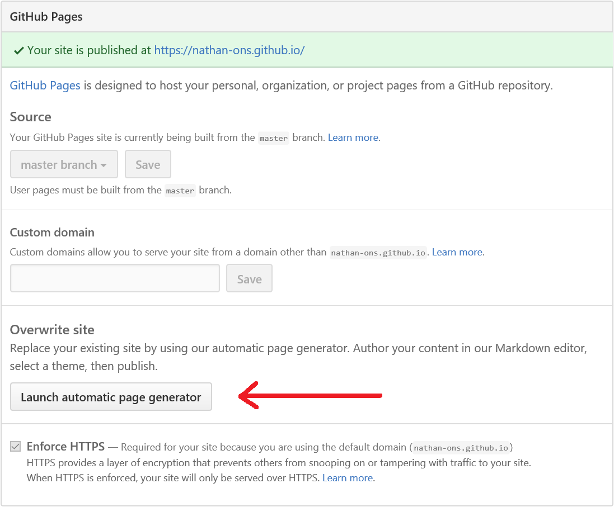
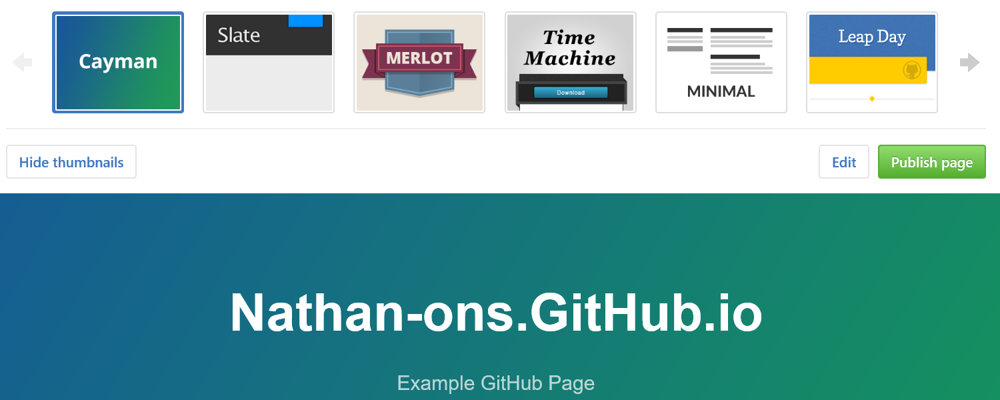

# Outline

```{r setup, echo = FALSE}
options(width = 55)
```

## 1. What is GitHub Pages?
## 2. User & Organization Pages
## 3. Project Pages
## 4. All Other Business

# What is GitHub Pages?

1. GitHub Pages is a static site hosting service.
2. Designed to host your personal, organisation or project pages directly from GitHub.
3. You get one site per GitHub account and organization, and unlimited project sites.

# User and Organisation Pages
## Create the repository

To create a user or organisation page, go to GitHub and create a new repository with the name `username.github.io` where `username` is your GitHub user name (or organisation name).

If the first part of the repository doesn't exactly match your GitHub username, it won't work, so make sure to get it right.

# User Pages
## Clone the repository

Go to the folder where you want to store your project, and clone the new repository:

```
> git clone https://github.com/username/username.github.io
```

# User Pages - Hello World
## Create your website

Enter the project folder and add an `index.html` file:

```
> cd username.github.io
> echo "Hello World" > index.html
```

# User Pages - Hello World
## Push it

Add, commit, and push your changes:

```
> git add .
> git commit -m "Initial commit"
> git push -u origin master
```

# { .fullpage }

<p class="subtitle subtitletop">User Pages</p>

# User Pages
## ...and you're done!

Fire up a browser and go to http://username.github.io.

# { .fullpage }

<p class="subtitle subtitletop">Organisation Pages</p>

# Project Pages
* Project pages are different to user or organisation pages.
* They live in a separate `gh-pages` branch.
* That means that you can work with GitHub Pages in the same repository as the project that it's for, without affecting the project itself.

# Automatic Page Generator
* You don't need to have the skills to design your own web page.
* There are pre-designed layouts available.
* To apply one, go to the Settings for your repository.
* Then launch the Automatic Page Generator

# { .fullpage }

<p class="subtitle subtitletop">Automatic Page Generator</p>

# { .fullpage }

<p class="subtitle subtitletop">Automatic Page Generator Layouts</p>

# Useage Limits

## GitHub Pages sites are subject to the following usage limits:

1. GitHub Pages source repositories have a recommended limit of 1GB .
2. Published GitHub Pages sites may be no larger than 1 GB.
3. GitHub Pages sites have a bandwidth limit of 100GB or 100,000 requests per month.
4. GitHub Pages sites have a limit of 10 builds per hour.

# Custom URLS
There are three main stages to using a custom URL

1. Choosing your custom domain and registering it with a DNS provider.
2. Adding your custom domain to your GitHub Pages site.
3. Configuring your domain with your DNS provider.

For more information see https://help.github.com/articles/using-a-custom-domain-with-github-pages/

# More information

Another R focused GitHub introduction is available here: http://happygitwithr.com/

# Summary
1. Create a new repository called `username.github.io`.
2. Create a file called `index.html` (do this on the `gh-pages` branch if it's for a project).
3. Apply a theme.
4. Ensure all files are committed.
5. Go to https://username.github.io.
